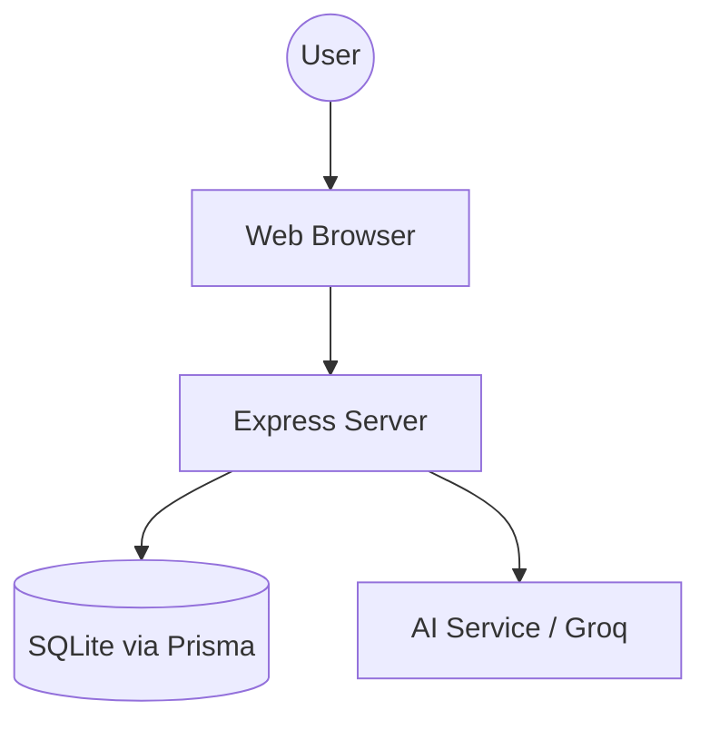

# Bread and Butter [bb]

Bread and Butter is a simple and clean notes application designed to help you organize your thoughts without any extra fuss. The idea was to create a workspace that feels like a physical notebook but with the power of modern tools. It is minimalist and focus oriented so you can just write.

## Why I Built This

I wanted something that is easy to use and looks good from the first second. Many note apps are either too simple or too complex. Bread and Butter sits right in the middle. It gives you a clean space to type but also uses smart technology to help you summarize or fix your writing when you need it.

## Features

*   Minimalist Editor: A clean writing space inspired by modern productivity tools.
*   Note Management: Create and delete notes easily from the sidebar.
*   Search: Quickly find any note by typing a keyword in the search bar.
*   AI Summarize: Get a very short gist of your long notes using smart processing.
*   AI Rewrite: A feature that takes your notes and cuts to the chase by making them more direct and clear.
*   Undo Option: If you don't like what the AI did you can always go back to your original version with one click.
*   Auto Save: Your work is saved automatically as you type so you never lose a thought.

## Tools and Substitutes

I used specific tools to make this app fast and reliable. Here is what I chose and why.

*   Node.js and Express: Used for the backend because it is fast and handles requests efficiently. You could use Python or Go as a substitute if you prefer.
*   Prisma and SQLite: Used for the database to keep everything local and simple. You could swap SQLite for PostgreSQL or MongoDB for larger projects.
*   Groq API: I used Groq for the AI features because it is incredibly fast. You can also use OpenAI or Anthropic by changing the API key and base URL in the code.
*   Lucide Icons: Used for the clean and consistent icons across the app. FontAwesome is a popular substitute here.
*   Vanilla CSS: I used plain CSS to have full control over the design and keep it lightweight.

## Architecture Diagram

## Installation Steps

1.  Make sure you have Node.js installed on your computer.
2.  Clone this folder to your local machine.
3.  Open your terminal inside the folder.
4.  Run the command **npm install** to get all the necessary packages.
5.  Create a file named **.env** in the main folder.
6.  Add your API key inside the .env file like this: **GROQ_API_KEY=your_key_here**.
7.  Run **npx prisma migrate dev** to set up your database.
8.  Type **npm start** to run the app.
9.  Open your browser and go to **http://localhost:3000**.

## Troubleshooting

*   Server not starting: Check if another app is using port 3000. You can change the port in the server file if needed.
*   AI Features not working: Double check your API key in the .env file. Also ensure you have an active internet connection.
*   Notes not saving: Make sure the database file was created during the installation steps.

## Future Improvements

*   Tags and Categories: Adding a way to group notes by topics.
*   Themes: A toggle between dark mode and light mode for better comfort.
*   Rich Export: Allowing users to save their notes as PDF or Markdown files.
*   Flashcards: An AI feature that creates quiz questions from your notes to help you learn.

## Demo Video

[Add your demo video link or file here]

## License

Copyright 2026 Sakshi Pathak. All rights reserved. 
This project is for personal use and study.
